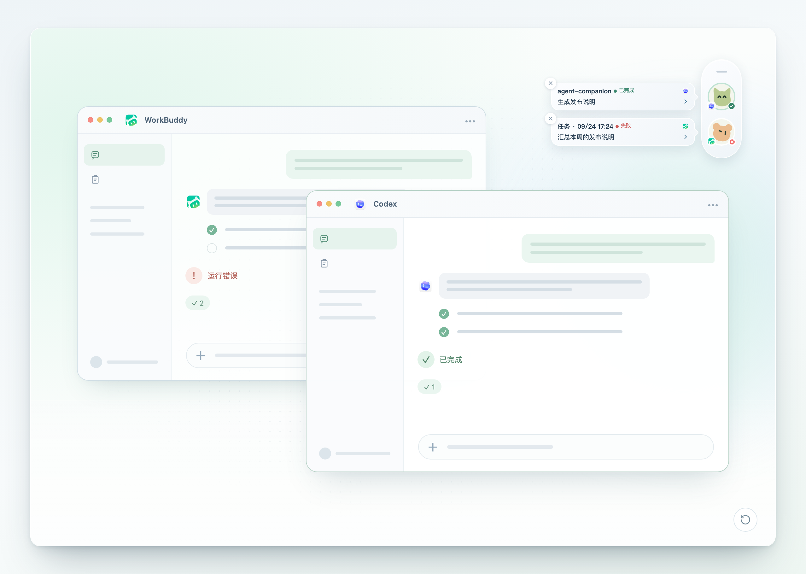
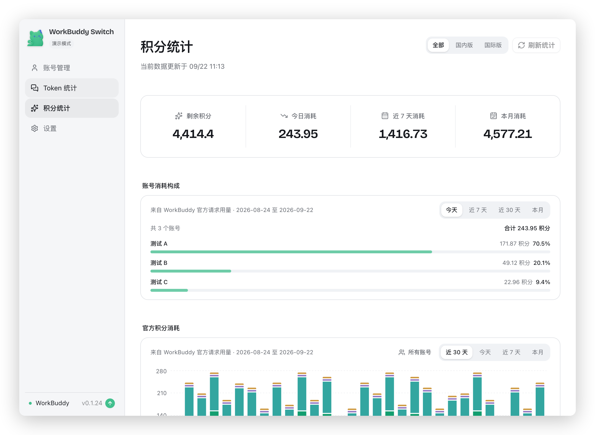

# Xbuddy-Switch

WorkBuddy、CodeBuddy IDE、CodeBuddy CLI 与 VS Code CodeBuddy 插件账号切换桌面 App（Tauri），四者均支持国内版 / 国际版，并提供积分到期与 Token 用量监控。

> 本项目基于 [changexbc/workbuddy-switch](https://github.com/changexbc/workbuddy-switch) 二次开发，
> 额外提供**新人礼包 / 成长计划批量处理**能力，并更名、换标为 XBuddy-Switch。

<p align="center">
  
</p>

多账号共享登录态，一键切换 WorkBuddy 登录账号。**会话复制**：把当前账号的会话以新 id 复制给目标账号，源账号数据不受影响，云端归属目标账号。

**在线演示**：[打开 GitHub Pages 演示](https://mingjuntx-hash.github.io/Xbuddy-Switch/)（只读演示；账号、积分与请求记录均为虚构数据，所有业务操作均已禁用。需在仓库 Settings → Pages 中开启后才能访问。）

## 快速开始

前往 [GitHub Releases](https://github.com/mingjuntx-hash/Xbuddy-Switch/releases/latest) 下载对应平台的安装包：

| 平台 | 安装包 | 安装方式 |
| --- | --- | --- |
| macOS Apple Silicon（M 系列，arm64） | `XBuddy-Switch_<版本>_aarch64.dmg` | 打开 DMG，将 `XBuddy-Switch.app` 拖入「应用程序」 |
| macOS Intel（x86_64） | `XBuddy-Switch_<版本>_x86_64.dmg` | 打开 DMG，将 `XBuddy-Switch.app` 拖入「应用程序」 |
| Windows x64 | `XBuddy-Switch_<版本>_x64-setup.exe` | 运行安装程序并按提示完成安装 |
| Linux x64 | `XBuddy-Switch_<版本>_amd64.deb` / `XBuddy-Switch_<版本>_amd64.AppImage` | Debian/Ubuntu 安装 `.deb`；其他发行版可给 AppImage 添加执行权限后直接运行 |

macOS 首次启动若提示无法验证开发者，先在 Finder 中按住 Control 点击应用并选择「打开」，或前往「系统设置 → 隐私与安全性」选择「仍要打开」。仅当安装包来自上述官方 Releases、且系统仍提示「已损坏」时，再执行：

```bash
xattr -rd com.apple.quarantine "/Applications/XBuddy-Switch.app"
```

应用能启动但切换账号时提示无权限，请参阅下方 [macOS 权限说明](#macos-权限说明)。

另有 npm / webui 版本可在浏览器中使用，见文末 [npm / webui 版本](#npm--webui-版本)。

## 功能

| 模块 | 说明 |
| --- | --- |
| 账号管理 | OAuth 扫码登录、导入导出账号、删除账号 |
| 账号备注 | 给每个账号写一句「这个号主要干嘛」，卡片与切号弹窗都显示，避免切错账号（本分支特有） |
| 账号切换 | 一键切换 WorkBuddy 登录账号，切换过程实时显示进度 |
| 会话复制 | 把当前账号勾选的会话复制给目标账号，源账号数据不受影响 |
| 新人礼包 | 邀请码绑定（支持粘贴邀请链接自动解析）、自动接受成长计划任务、自动领取已完成任务奖励 |
| 一键处理全部账号 | 受控并发（`Semaphore(4)`）批量执行所有账号的接受与领取，结果按账号顺序回填，多账号总耗时接近单账号耗时 |
| 签到 | 全新安装默认关闭，可在设置页开启；支持按账号关闭，刷新时跳过并提示 |
| 积分到期查询 | 自动查询每个账号的积分剩余量与到期时间；7 天内到期高亮，并按紧迫程度排序、标注「建议优先使用」 |
| 积分统计 | 汇总官方请求用量：总览、近 30 天趋势、模型分类、账号消耗与请求明细 |
| Token 统计 | 按来源查看 Token 总览与趋势，含构成占比、活跃热力图、项目/模型 Top 10 与会话排行 |
| CodeBuddy CLI | 与 WorkBuddy 复用同一账号库，默认账号独立；切换后立即生效，无需重启 CLI |
| CodeBuddy IDE | 支持切换 CodeBuddy IDE 桌面客户端账号，并可在弹窗中勾选复制会话，与 CodeBuddy CLI 相互独立 |
| VS Code CodeBuddy 插件 | 支持切换 VS Code 内的 CodeBuddy 插件账号；VS Code 运行时可自动关闭并在写入后重新打开 |
| JetBrains IDE 插件 | 支持切换 IntelliJ IDEA / PyCharm 内的 CodeBuddy 插件账号，一次切换写入所有装了插件的 IDE；IDE 运行时可自动关闭并在写入后重新打开 |
| 插件会话复制 | 切换插件账号时，可把当前插件账号的会话复制给目标账号（加法，源账号不变） |
| 自动轮换 | 后台把积分最紧迫的账号设为 CodeBuddy CLI 后续启动账号；检测到 CLI 会话运行时会跳过 |
| 自动更新 | 从 GitHub Releases 检查新版本，整包更新经签名校验 |
| 会话悬浮窗 | 桌面版内置 Agent Companion 悬浮栏，在桌面集中显示 Codex / WorkBuddy / CodeBuddy / Codeg 会话的运行中 / 待确认 / 已完成状态；悬停查看详情，支持跳转时点击回到原会话，托盘可临时隐藏 |
| 权限检测 | macOS 授权引导（App 管理 / 完全磁盘访问拖拽授权 + 自动检测） |

## 支持的工具

| 工具 | 账号切换 | 会话复制 | 自动关闭重开 | 自动轮换 | 悬浮窗监听 |
| --- | :---: | :---: | :---: | :---: | :---: |
| WorkBuddy | ✅ | ✅ | ✅ | — | ✅ |
| CodeBuddy IDE | ✅ | ✅ | ✅ | — | ✅ |
| CodeBuddy CLI | ✅ | — | — | ✅ | — |
| VS Code CodeBuddy 插件 | ✅ | ✅ | ✅ | — | ✅ |
| JetBrains IDE 插件（IDEA / PyCharm） | ✅ | — | ✅ | — | — |

✅ 表示支持，— 表示不支持。设置 →「支持工具」可按客户端逐个开启 / 关闭入口；关闭后该端入口与状态轮询一并隐藏，不影响账号库与其它端；JetBrains 端默认关闭，可在设置中随时打开。

CodeBuddy CLI 切换时会先关闭正在运行的 CLI，当前会话会中断且不会自动重开；其余各端可在客户端运行时自动完成切换。

### 会话悬浮窗（Agent Companion）

桌面版内置 [Agent Companion](https://github.com/changexbc/agent-companion) 悬浮栏：把各 AI Agent 的任务状态集中到桌面，一眼看出谁还在运行、谁需要你确认，支持跳转时点击即可回到原会话；悬浮栏可拖动调整位置，托盘可随时显示 / 隐藏。

| 监听来源 | 跳转到指定会话 | 点击后的行为 |
| --- | :---: | --- |
| Codex（Desktop / CLI） | ✅ | 打开 Codex Desktop 中的指定任务 |
| WorkBuddy（国内版 / 国际版） | ✅ | 打开对应版本中的指定对话 |
| CodeBuddy IDE（国内版 / 国际版） | — | 有工程路径时打开工程，否则只唤起 CodeBuddy |
| CodeBuddy VS Code 插件 | — | 尝试打开会话所属的 VS Code 工程，无法确定时只唤起 VS Code |
| Codeg | ✅ | 打开 Codeg 中的指定聊天会话 |

各来源都会显示运行中 / 待确认 / 已完成状态；CodeBuddy CLI 与 JetBrains 插件不在监听范围内。开启方式：左下角悬浮窗图标，或设置 → Agent Companion；首次使用在「悬浮窗设置」中完成接入（依赖对应客户端的 Hooks / Webhook），监听来源与外观样式也在那里调整。

> ⚠️ **XBuddy-Switch 分支说明**：本分支默认使用**便携版打包**（不跑 `tauri build` 的完整打包流程），
> 因此**未内嵌 Agent Companion 运行时**（`src-tauri/binaries/agent-studio-runtime-*`）。
> 该功能默认关闭，不影响账号切换；若需要悬浮窗，请自行执行
> `npm run dev:desktop`/`build:desktop`（会拉起 `scripts/prepare-agent-companion.mjs` 编译运行时），
> 或改用上游官方发行版。
>
> 与之配套，本分支的 `src-tauri/tauri.conf.json` **移除了 `bundle.externalBin`**（上游为打包悬浮窗运行时而加）。
> 原因是 `tauri-build` 在编译期就会校验该路径，运行时二进制不存在会直接让 `cargo build` 失败并报
> `resource path binaries/agent-studio-runtime-<target>.exe doesn't exist`。移除后 UI、托盘在内的其他功能
> 不受影响（插件本身在未启用时不会去启动运行时，连接失败也被 `.ok()` 吞掉）。
> 若将来要恢复悬浮窗，需**先**用 `npm run build:desktop` 生出 `src-tauri/binaries/agent-studio-runtime-*`，
> **再**把 `externalBin` 加回去，两步缺一不可。

网页演示里的悬浮栏：一个已完成的 Codex 会话与一个失败的 WorkBuddy 会话，各自弹出信息卡（截自[在线演示](https://changexbc.github.io/agent-companion/)，数据为虚构）。



更多说明与独立版见 [Agent Companion 仓库](https://github.com/changexbc/agent-companion) · [在线演示](https://changexbc.github.io/agent-companion/)

## 新人礼包与成长计划

本分支在官方能力之上，额外提供成长计划任务的批量处理：

- **邀请码绑定**：可直接粘贴完整邀请链接，自动解析出邀请码；新账号在添加后可自动绑定
- **成长计划任务**：可开启「自动接受成长计划任务」与「自动领取已完成任务奖励」，回到面板点「一键处理全部账号」即可批量执行
- **一键处理全部账号**：受控并发跑完所有账号的接受 + 领取流程，结果按账号顺序回填，面板显示每个账号的领取明细
- **成长计划入口**：面板上可直达官方成长计划页面

> 「任务自动化」相关能力已实现，但**默认关闭**：它依赖客户端以调试端口启动，而该端口每次客户端重启即失效，使用成本高于收益。

## 账号备注

账号一多就分不清哪个是干嘛的。给每个账号写一句备注（例如「主力号 · 公司项目」），切换时一眼就能认出目标账号。这是本分支特有的能力，上游没有这个字段。

- **在哪写**：账号卡片右上角「⋯」→「添加备注 / 编辑备注」；卡片上已经显示了备注时，直接点那枚备注 chip 也能改
- **在哪看**：账号卡片头部（琥珀色 chip），以及**所有**切号确认弹窗——WorkBuddy、CodeBuddy IDE、VS Code 插件、JetBrains 插件、CodeBuddy CLI。点「确认切换」之前最后一眼就能核对，不必回列表翻
- **存哪**：本机账号库 `~/.wb-switch/accounts.json` 里与 `uid`/`nickname` 同级的 `note` 键。它只是一段文本，**不参与**登录、切换与任何接口调用，因此不会影响既有功能
- **怎么删**：弹窗里清空内容再保存即可（会删掉整个键，不会留下空串）
- **长度**：最多 60 个字符，够写「主力号 · 公司项目 · 10/12 到期」这种量级

两个边界情况，先说清楚免得意外：

- 本机重导入（「导入本机账号」）与扫码重加**不会**动已有备注——采集到的记录里没有这个字段，后端会显式继承本地那份
- 「导入备份」是整条记录覆盖，**以文件内容为准**：文件里带备注就用文件里的，文件里没有就把本地那条清掉（其他字段同理）

## 使用

1. **添加与导出账号**：账号页 →「OAuth 扫码登录」「导入本机账号」「导入备份」；「导出」可将勾选账号备份为 JSON
2. **切换账号**：账号卡片 →「切换」，可勾选复制当前会话
3. **写账号备注**：账号卡片「⋯」→「添加备注」，或直接点卡片上的备注 chip；切换时的确认弹窗里也会显示这条备注
4. **新人礼包**：账号页底部面板 → 填入邀请码（可直接粘贴邀请链接）→「保存」；按需开启「自动接受成长计划任务」与「自动领取已完成任务奖励」；点「一键处理全部账号」批量执行
5. **查看积分与统计**：账号页自动查询各账号积分到期情况，点「刷新积分」手动更新；侧栏进入「积分统计」「Token 统计」查看用量明细
6. **签到**：全新安装默认关闭，全局开关、按账号开关与日志位于设置页。关闭某账号的自动签到后，后台轮次、页面签到状态查询、刷新附带签到与「全部立即签到」（设置页 / 托盘）均忽略该账号，积分照常刷新并提示忽略数量；仅账号卡片的单账号「手动签到」不受影响
7. **切换各客户端账号**：CodeBuddy CLI、CodeBuddy IDE、VS Code CodeBuddy 插件、JetBrains IDE 插件均可在账号卡片一键切换；其中 CodeBuddy IDE 与两个插件端支持在弹窗中勾选复制当前账号的会话。CodeBuddy IDE 首次使用前需先手动打开并登录一次
8. **开关各端入口**：设置 →「支持工具」可按客户端逐个开启 / 关闭入口；关闭后该端在账号页隐藏、不再轮询状态，不影响账号库。JetBrains 端默认关闭
9. **自动轮换**：设置 → CodeBuddy CLI 自动轮换，开启后按积分紧迫程度自动设置默认账号
10. **更新**：应用会自动检查公开 GitHub Releases；发现新版本后可在左下角直接升级，也可从设置页打开 Release 页面手动下载

## 界面预览

### 管理 WorkBuddy 与 CodeBuddy 账号

账号卡片集中展示登录状态、积分余额和到期资源，临期积分直接标注在对应卡片内，并按紧迫程度优先排列。


### 积分统计

积分统计页展示官方请求用量、每日趋势、模型分布、账号消耗和请求明细，数据来源与更新时间会明确显示。



### Token 统计

Token 统计页按来源展示 Token 总览与趋势、构成占比、活跃热力图、项目/模型 Top 10 与会话排行。


## macOS 权限说明

切换账号需要写入 WorkBuddy 认证文件，macOS 要求授权「App 管理」（或「完全磁盘访问」）：

1. 首次切换报「无权限」时，点「打开系统设置」
2. 优先在 **App 管理** 里打开 XBuddy-Switch 开关；若没有，则去 **完全磁盘访问** 把 XBuddy-Switch 拖进带箭头的框
3. 授权后重启本应用生效；设置页「权限检测」可随时验证

## npm / webui 版本

```bash
npm i -g xbuddy-switch
xbuddy-switch              # 启动本地服务 + 自动打开浏览器
xbuddy-switch status       # 终端查看当前账号
```

界面与桌面 App 一致，功能覆盖上方全部模块，但不提供会话悬浮窗（桌面版专属）。webui 模式下的 macOS 权限由启动服务的终端进程决定；若终端已授权完全磁盘访问则无需额外操作。

## 致谢

感谢 [Linux.do](https://linux.do) 社区。

## 许可

[MIT](./LICENSE)
